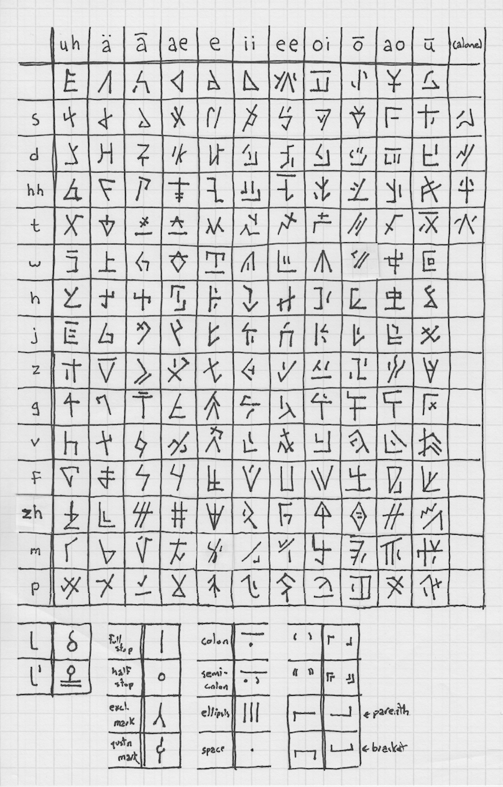

#  LANGDEV IN UNICODE :: 02 JASTU-SEVENSI  #

The Jastu-Sevensi family of languages were the first independent language family developed by The LANGDEV Project.
A large number of scripts have been created over the course of this development, and more are planned for the future.

The scripts defined in this chapter are:

- **Jastugay**
- **Runic Sevensi**
- **Sevensi**

The following scripts are also planned:

- **Sevensi Ideographs**

##  Jastugay  ##

Jastugay [Jästūgā] is a depreciated language created in the early days of The LANGDEV Project which later served as the base for Proto&ndash;Jastu-Sevensi.
A syllabary was developed for writing this language; it was generally written top-to-bottom, starting from the right, or left-to-right, starting from the top.

The development base for the Jastugay syllabary was a small subset of Jastugay ideographic characters, which were never standardized.
These characters may, however, be encoded as part of the Sevensi Ideographs at some point in the future.

####  Depreciated characters  ####

Many of the characters originally created for the Jastugay syllabary fell out of use as the syllabary was simplified, and other characters changed meanings.
This specification encodes the syllabary as it was originally created, as this represents a superset of all characters which have ever been put into use.
However, one should be aware that not all uses of the Jastugay syllabary necessarily employ all of the characters, or with the explicit meanings suggested by their names here.

####  Encoding principles  ####

The Jastugay syllabary is traditionally represented as a matrix of 11 vowels and 16 consonants (including the null consonant).
The encoding of the syllabary into Unicode follows this representation, containing eleven rows of sixteen consonants each (`U+101100..U+1011AF`).
Certain consonants can be represented without a vowel attached; these are encoded in the twelfth row (`U+1011B0..U+1011BF`).
Note that the consonant *l* can *only* be represented in this manner; for each of the previous rows this column will be left unassigned.

> 
>
> *Traditional Jastugay syllabary chart*

####  The consonant *l*  ####

The consonant `U+1011BF JASTUGAY SYLLABLE L` takes a vastly different form when it is followed immediately by another letter, referred to as its *affix form*.
This change in appearance is required for support by rendering processes.

In some instances, it may be important to represent the affix form of `U+1011BF JASTUGAY SYLLABLE L` in isolation.
The sequence `U+1011BF JASTUGAY SYLLABLE L` + ZWJ is used for this purpose.

As indicated by [LineBreak.txt](ucd/langdev/LineBreak.txt), lines may be broken after `U+1011BF JASTUGAY SYLLABLE L`.
This does not affect its appearance.

####  *-n* form  ####

The characters `U+101130..U+10113E` have an alternate form, traditionally represented by affixing a vertical bar to their right, which designates that the character should be followed with an *n* sound.
This is implemented as a diacritic: `U+1011D0 JASTUGAY COMBINING MARK N`.

####  Punctuation  ####

The Jastugay script has its own unique punctuation, which is encoded in the block `U+1011C0..U+1011CF JASTUGAY PUNCTUATION`.
Of particular note is `U+1011C7 JASTUGAY WORD SEPARATOR`, which is used instead of a space between words.
Rendering processes should suppress the display of `U+1011C7 JASTUGAY WORD SEPARATOR` when a line break occurs directly after its position.

####  Code charts  ####

- [`U+101100..U+1010BF Jastugay Syllabary`](charts/101100.md)
- [`U+1011C0..U+1011CF Jastugay Punctuation`](charts/1011C0.md)
- [`U+1011C0..U+1011CF Jastugay Combining Marks`](charts/1011D0.md)

##  Sevensi  ##

Classical Sevensi was traditionally written one of three ways.
The first, a logographic system, is presently beyond the scope of this document, but may find encoding an a later version of *LANGDEV in Unicode*.

The second is an abjad, henceforth referred to as *Runic Sevensi*, the letters of which are sometimes referred to as *runes* and are written in a disjointed manner.
Runic Sevensi is often written top-to-bottom starting from the right, but may also appear written right-to-left or left-to-right starting from the top.

The third is a cursive script, henceforth referred to as *Sevensi script* or simply *Sevensi*.
Sevensi script is derived from runic Sevensi but features several innovations and distinctive features.
This is the script in which Sevensi has been recorded up until the modern day.
Text in this script is written left-to-right starting from the top.

Because Sevensi script is cursive even when typeset, many letters will assume a different position depending on where in the word they are found.
Shaping rules for the rendering of text are included in the section for Sevensi script below.

###  Runic Sevensi:  ###

Runic Sevensi is an abjad which may be written top-to-bottom starting from the right, or either right-to-left or left-to-right starting from the top.
When it is written right-to-left, the glyphs of Runic Sevensi should be mirrored.

The term *Runic Sevensi* is an allusion to its characters' appearance and is not meant to suggest a connection to the runic alphabet&mdash;the two developed quite independently.

####  Encoding principles  ####

The original Runic Sevensi abjad consists of fifteen letters, which are encoded in their traditional order in the range `U+1011E0..U+1011EE`.
In addition, devoiced forms of Runic Sevensi letters can be created with the addition of an extra stroke.
These forms are encoded separately in the range `U+1011F0..U+1011FE`.
Note that not all Runic Sevensi letters have a devoiced form&mdash;where none exists, the code point is left unassigned.

####  Appearance  ####

Runic Sevensi letters have slightly different appearances depending on the medium on which they are recorded:
Letters written with ink are more rounded, while letters carved into a medium are more angular.
There is no semantic difference between angular and rounded characters, and this is a distinction best made using markup.
Consequently, the rounded and angular forms of a character share the same encoding in this specification.

####  Punctuation  ####

Traditionally, Runic Sevensi was not written using punctuation.
However, spaces were used to separate words.

####  Code charts  ####

- [`U+1011E0..U+1010EF Runic Sevensi`](charts/1011E0.md)

###  Sevensi:  ###

Sevensi script evolved from its runic predecessor as a means of writing the language both faster and more efficiently.
It consists of eight base consonants, each of which may be augmented by either a devoicing mark or a ring mark.
There are an additional four letters which do not accept modification, and one which features both marks, for a total of 23 letters.
Sevensi script is an abjad, and so no letters represent vowels directly.
However, the letters for *w* and *y* are often used in a vocalic manner.

Sevensi script is cursive, even in its printed form.
Consequently, the same letter may be represented somewhat differently depending on the characters which surround it.
The details of this process are given below, in the section “Sevensi cursive joining.”

Sevensi script is written from left to right, starting from the top of the page.

####  Vowel harmony  ####

Although Sevensi script does not record vowels, it does record vowel harmonies via one of two word-final strokes.
These are encoded as `U+101220 SEVENSI POSITIVE HARMONY MARK` and `U+101221 SEVENSI NEGATIVE HARMONY MARK`.

Words which have neutral harmonies may be set off from surrounding text using ZWNJ in instances where this distinction would otherwise be ambiguous.
Note that the signification of vowel harmony extends backwards to the beginning of the word, but does not extend forward.

####  Encoding principles  ####

Because the devoicing and ring marks produce new letters with separate meanings, they are not encoded separately as combining marks.
Instead, each resultant character is provided its own encoding.

The letters of Sevensi script are encoded in the block `U+101200..U+10121F SEVENSI LETTERS` as follows:

-   The four consonants which do not accept modification are encoded first, in the range `U+101200..U+101203`.

-   The remaining unmodified consonants are encoded in the range `U+101204..101209`.

-   The devoiced consonants are encoded in the range `U+10120A..U+10120F`.

-   The ring-marked consonants are encoded in the range `U+101210..U+101215`.

-   The only letter to feature both marks is encoded as `U+101216 SEVENSI LETTER C`.

Non-combining forms of the devoicing and ring marks, in addition to positive and negative harmony markings, are encoded in the block `U+101220..U+10122F SEVENSI MARKS AND PUNCTUATION`.

The *wy* ligature is encoded in the block `U+101230..U+10123F SEVENSI PRESENTATION FORMS`.

####  ZWJ and ZWNJ  ####

In order to allow a character to form a cursive connection without a visible neighbour (for example, when displaying cursive characters in isolation), `U+200D ZERO WIDTH JOINER` may be used.
Similarly, `U+200C ZERO WIDTH NON-JOINER` may be used to prevent a cursive connection where one would otherwise be rendered (however, as vowel harmony marks are terminal, this is only necessary when dealing with harmony-neutral morphemes).
Neither character is usually required for everyday usage.

####  Sevensi cursive joining  ####

#####  minimum rendering requirements  #####

The cursive nature of the Sevensi script imposes special requirements for display and rendering that are not typically found in Latin script-based systems.
Ideally, processes should select an appropriate glyph to depict each Sevensi letter according to its immediate context, as well as substitute certain ligature glyphs for sequences of Sevensi characters.
This section specifies a minimum set of rules for Sevensi joining and ligature behaviour.

In instances where conformance with this section is not possible, the default rendering for a Sevensi script character should be the first available form in the following list:

>   medial, final, initial, isolated

In most instances, failing to support the rules provided by this section will not produce illegible text.

#####  joining types  #####

Each Sevensi letter must be depicted by one of a number of possible contextual glyph forms, determined on the basis of the cursive joining behaviour of that character as it interacts with those around it.
*The Unicode Standard* has formally described such joining behaviour using a character property called Joining_Type.
Each Sevensi character falls into one of the types shown in the following table:

| Joining_Type    | Abbreviation | Description |
| --------------- | ------------ | ----------- |
| Right_Joining   | R            | No Sevensi characters are in this category. |
| Left_Joining    | L            | These characters can join with those to their left but not those to their right. The vowel harmony marks and the letters *l* and *tl* are in this category. |
| Dual_Joining    | D            | These characters can join with those on either side. Most Sevensi letters are in this category. |
| Joining_Causing | C            | No Sevensi characters are in this category, but note that ZWJ is. |
| Non_Joining     | U            | ZWNJ, spaces, and punctuation. |
| Transparent     | T            | Nonspacing marks. |

As you can see, the bulk of Sevensi characters are either Left_Joining or Dual_Joining.
Note that the words *left* and *right* here refer to the visual order.

#####  joining rules  #####

Implementations should conform to the joining rules specified for Arabic characters in *Section 9.3, Arabic* of *The Unicode Standard* when displaying Sevensi characters.

#####  ligature joining groups  #####

The characters `U+101215 SEVENSI LETTER W` and `U+101211 SEVENSI LETTER Y` form a ligature when they appear together in sequence.
This specification defines two joining groups, `SEVENSI_W` and `SEVENSI_Y`, which handle the ligature formation for these characters.

In the following rules, if *X* and *Y* refer to characters, then the following table describes the notation for various glyph types representing combinations of those characters.
See *Table 9-5 Arabic Glyph Types* in *The Unicode Standard* for definitions of *Xr*, *Xl*, and *Xm*

| Symbol            | Description |
| ----------------- | ----------- |
| (X-Y)n | Nominal ligature glyph form representing a combination of an Xr form and a Yl form. |
| (X-Y)l | Left-joining ligature glyph form representing a combination of an Xm form and a Yl form. |
| (X-Y)r | Left-joining ligature glyph form representing a combination of an Xr form and a Ym form. |
| (X-Y)m | Left-joining ligature glyph form representing a combination of an Xm form and a Ym form. |

1.  Transparent characters do not affect the ligating behavior of  base (nontransparent) characters.

2.  Any sequence with *SEVENSI_Wr* on the left and *SEVENSI_Yl* on the right will form the ligature *(SEVENSI_W-SEVENSI_Y)n*.

3.  Any sequence with *SEVENSI_Wm* on the left and *SEVENSI_Yl* on the right will form the ligature *(SEVENSI_W-SEVENSI_Y)l*.

4.  Any sequence with *SEVENSI_Wr* on the left and *SEVENSI_Ym* on the right will form the ligature *(SEVENSI_W-SEVENSI_Y)r*.

5.  Any sequence with *SEVENSI_Wm* on the left and *SEVENSI_Ym* on the right will form the ligature *(SEVENSI_W-SEVENSI_Y)m*.

The *wy* ligature is also encoded separately at `U+101230 SEVENSI LIGATURE WY`, but this should *not* be used in general interchange, as it will interfere with basic features such as alphabetization and searching of text.

####  Code charts  ####

- [`U+101200..U+10121F Sevensi`](charts/101200.md)
- [`U+101220..U+10123F Sevensi Marks and Punctuation`](charts/101220.md)
- [`U+101230..U+10124F Sevensi Presentation Forms`](charts/101230.md)
