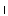
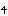

#  `U+101000..U+10103F Bencode`  #

####  Uppercase Bencode alphabet  ####

|  Code  |    Text    |                 As Image                 | Entry |
| -----: | :--------: | :--------------------------------------: | :---- |
| 101000 | &#x101000; |  | BENCODE CAPITAL LETTER A |
| 101001 | &#x101001; |  | BENCODE CAPITAL LETTER B |
| 101002 | &#x101002; |  | BENCODE CAPITAL LETTER C   • In older texts, 10100A &#x10100A; or 101012 &#x101012; were used instead |
| 101003 | &#x101003; |  | BENCODE CAPITAL LETTER D |
| 101004 | &#x101004; |  | BENCODE CAPITAL LETTER E |
| 101005 | &#x101005; |  | BENCODE CAPITAL LETTER F |
| 101006 | &#x101006; |  | BENCODE CAPITAL LETTER G |
| 101007 | &#x101007; |  | BENCODE CAPITAL LETTER H |
| 101008 | &#x101008; |  | BENCODE CAPITAL LETTER I |
| 101009 | &#x101009; |  | BENCODE CAPITAL LETTER J |
| 10100A | &#x10100A; |  | BENCODE CAPITAL LETTER K |
| 10100B | &#x10100B; |  | BENCODE CAPITAL LETTER L |
| 10100C | &#x10100C; |  | BENCODE CAPITAL LETTER M |
| 10100D | &#x10100D; |  | BENCODE CAPITAL LETTER N |
| 10100E | &#x10100E; |  | BENCODE CAPITAL LETTER O |
| 10100F | &#x10100F; |  | BENCODE CAPITAL LETTER P |
| 101010 | &#x101010; |  | BENCODE CAPITAL LETTER Q   • Originally a ligature of 10100A &#x10100A; and 101016 &#x101016; |
| 101011 | &#x101011; |  | BENCODE CAPITAL LETTER R |
| 101012 | &#x101012; |  | BENCODE CAPITAL LETTER S |
| 101013 | &#x101013; |  | BENCODE CAPITAL LETTER T |
| 101014 | &#x101014; |  | BENCODE CAPITAL LETTER U |
| 101015 | &#x101015; |  | BENCODE CAPITAL LETTER V |
| 101016 | &#x101016; |  | BENCODE CAPITAL LETTER W |
| 101017 | &#x101017; |  | BENCODE CAPITAL LETTER X   • Originally a ligature of 10100A &#x10100A; and 101012 &#x101012;  |
| 101018 | &#x101018; |  | BENCODE CAPITAL LETTER Y |
| 101019 | &#x101019; |  | BENCODE CAPITAL LETTER Z |
| 10101A | &#x10101A; |  | BENCODE CAPITAL LETTER CH |

####  Bencode punctuation  ####

|  Code  |    Text    |                 As Image                 | Entry |
| -----: | :--------: | :--------------------------------------: | :---- |
| 10101B | &#x10101B; |  | BENCODE FULL STOP |
| 10101C | &#x10101C; |  | BENCODE COMMA |
| 10101D | &#x10101D; |  | BENCODE APOSTROPHE |
| 10101E | &#x10101E; |  | BENCODE LEFT DOUBLE QUOTATION MARK |
| 10101F | &#x10101F; |  | BENCODE RIGHT DOUBLE QUOTATION MARK |

####  Lowercase Bencode alphabet  ####

|  Code  |    Text    |                 As Image                 | Entry |
| -----: | :--------: | :--------------------------------------: | :---- |
| 101020 | &#x101020; |  | BENCODE SMALL LETTER A |
| 101021 | &#x101021; |  | BENCODE SMALL LETTER B |
| 101022 | &#x101022; |  | BENCODE SMALL LETTER C   • In older texts, 10102A &#x10102A; or 101032 &#x101032; were used instead |
| 101023 | &#x101023; |  | BENCODE SMALL LETTER D |
| 101024 | &#x101024; |  | BENCODE SMALL LETTER E |
| 101025 | &#x101025; |  | BENCODE SMALL LETTER F |
| 101026 | &#x101026; |  | BENCODE SMALL LETTER G |
| 101027 | &#x101027; |  | BENCODE SMALL LETTER H |
| 101028 | &#x101028; |  | BENCODE SMALL LETTER I |
| 101029 | &#x101029; |  | BENCODE SMALL LETTER J |
| 10102A | &#x10102A; |  | BENCODE SMALL LETTER K |
| 10102B | &#x10102B; |  | BENCODE SMALL LETTER L |
| 10102C | &#x10102C; |  | BENCODE SMALL LETTER M |
| 10102D | &#x10102D; |  | BENCODE SMALL LETTER N |
| 10102E | &#x10102E; |  | BENCODE SMALL LETTER O |
| 10102F | &#x10102F; |  | BENCODE SMALL LETTER P |
| 101030 | &#x101030; |  | BENCODE SMALL LETTER Q   • Originally a ligature of 10102A &#x10102A; and 101036 &#x101036; |
| 101031 | &#x101031; |  | BENCODE SMALL LETTER R |
| 101032 | &#x101032; |  | BENCODE SMALL LETTER S |
| 101033 | &#x101033; |  | BENCODE SMALL LETTER T |
| 101034 | &#x101034; |  | BENCODE SMALL LETTER U |
| 101035 | &#x101035; |  | BENCODE SMALL LETTER V |
| 101036 | &#x101036; |  | BENCODE SMALL LETTER W |
| 101037 | &#x101037; |  | BENCODE SMALL LETTER X   • Originally a ligature of 10102A &#x10102A; and 101032 &#x101032;  |
| 101038 | &#x101038; |  | BENCODE SMALL LETTER Y |
| 101039 | &#x101039; |  | BENCODE SMALL LETTER Z |
| 10103A | &#x10103A; |  | BENCODE SMALL LETTER CH |

####  Bencode punctuation  ####

|  Code  |  Rendered  |                 As Image                 | Entry |
| -----: | :--------: | :--------------------------------------: | :---- |
| 10103B | &#x10103B; |  | BENCODE COLON |
| 10103C | &#x10103C; |  | BENCODE SEMICOLON |
| 10103D | &#x10103D; |  | BENCODE HYPHEN |
| 10103E | &#x10103E; |  | BENCODE LEFT SINGLE QUOTATION MARK |
| 10103F | &#x10103F; |  | BENCODE RIGHT SINGLE QUOTATION MARK |
