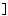

#  `U+101040..U+10104F Bencode Supplemental Punctuation`  #

|  Code  |    Text    |                 As Image                 | Entry |
| -----: | :--------: | :--------------------------------------: | :---- |
| 101040 | &#x101040; |  | BENCODE LEFT PARENTHESIS |
| 101041 | &#x101041; |  | BENCODE RIGHT PARENTHESIS |
| 101042 | &#x101042; |  | BENCODE LEFT SQUARE BRACKET |
| 101043 | &#x101043; |  | BENCODE RIGHT SQUARE BRACKET |
| 101044 | &#x101044; |  | BENCODE EXCLAMATION MARK |
| 101045 | &#x101045; |  | BENCODE QUESTION MARK |
| 101046 | &#x101046; |                                          | &lt;reserved&gt; |
| 101047 | &#x101047; |                                          | &lt;reserved&gt; |
| 101048 | &#x101048; |                                          | &lt;reserved&gt; |
| 101049 | &#x101049; |                                          | &lt;reserved&gt; |
| 10104A | &#x10104A; |                                          | &lt;reserved&gt; |
| 10104B | &#x10104B; |                                          | &lt;reserved&gt; |
| 10104C | &#x10104C; |                                          | &lt;reserved&gt; |
| 10104D | &#x10104D; |                                          | &lt;reserved&gt; |
| 10104E | &#x10104E; |                                          | &lt;reserved&gt; |
| 10104F | &#x10104F; |                                          | &lt;reserved&gt; |
