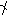
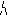
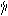

#  `U+101100..U+1011BF Jastugay Syllabary`  #

|  Code  |    Text    |                 As Image                 | Entry |
| -----: | :--------: | :--------------------------------------: | :---- |
| 101100 | &#x101100; |  | JASTUGAY SYLLABLE U |
| 101101 | &#x101101; |  | JASTUGAY SYLLABLE SU |
| 101102 | &#x101102; |  | JASTUGAY SYLLABLE DU |
| 101103 | &#x101103; |  | JASTUGAY SYLLABLE HHU |
| 101104 | &#x101104; |  | JASTUGAY SYLLABLE TU |
| 101105 | &#x101105; |  | JASTUGAY SYLLABLE WU |
| 101106 | &#x101106; |  | JASTUGAY SYLLABLE HU |
| 101107 | &#x101107; |  | JASTUGAY SYLLABLE JU |
| 101108 | &#x101108; |  | JASTUGAY SYLLABLE ZU |
| 101109 | &#x101109; |  | JASTUGAY SYLLABLE GU |
| 10110A | &#x10110A; |  | JASTUGAY SYLLABLE VU |
| 10110B | &#x10110B; |  | JASTUGAY SYLLABLE FU |
| 10110C | &#x10110C; |  | JASTUGAY SYLLABLE ZHU |
| 10110D | &#x10110D; |  | JASTUGAY SYLLABLE MU |
| 10110E | &#x10110E; |  | JASTUGAY SYLLABLE PU |
| 10110F | &#x10110F; |                                          | &lt;reserved&gt; |
| 101110 | &#x101110; |  | JASTUGAY SYLLABLE AH |
| 101111 | &#x101111; |  | JASTUGAY SYLLABLE SAH |
| 101112 | &#x101112; |  | JASTUGAY SYLLABLE DAH |
| 101113 | &#x101113; |  | JASTUGAY SYLLABLE HHAH |
| 101114 | &#x101114; |  | JASTUGAY SYLLABLE TAH |
| 101115 | &#x101115; |  | JASTUGAY SYLLABLE WAH |
| 101116 | &#x101116; |  | JASTUGAY SYLLABLE HAH |
| 101117 | &#x101117; |  | JASTUGAY SYLLABLE JAH |
| 101118 | &#x101118; |  | JASTUGAY SYLLABLE ZAH |
| 101119 | &#x101119; |  | JASTUGAY SYLLABLE GAH |
| 10111A | &#x10111A; |  | JASTUGAY SYLLABLE VAH |
| 10111B | &#x10111B; |  | JASTUGAY SYLLABLE FAH |
| 10111C | &#x10111C; |  | JASTUGAY SYLLABLE ZHAH |
| 10111D | &#x10111D; |  | JASTUGAY SYLLABLE MAH |
| 10111E | &#x10111E; |  | JASTUGAY SYLLABLE PAH |
| 10111F | &#x10111F; |                                          | &lt;reserved&gt; |
| 101120 | &#x101120; |  | JASTUGAY SYLLABLE AY |
| 101121 | &#x101121; |  | JASTUGAY SYLLABLE SAY |
| 101122 | &#x101122; |  | JASTUGAY SYLLABLE DAY |
| 101123 | &#x101123; |  | JASTUGAY SYLLABLE HHAY |
| 101124 | &#x101124; |  | JASTUGAY SYLLABLE TAY |
| 101125 | &#x101125; |  | JASTUGAY SYLLABLE WAY |
| 101126 | &#x101126; |  | JASTUGAY SYLLABLE HAY |
| 101127 | &#x101127; |  | JASTUGAY SYLLABLE JAY |
| 101128 | &#x101128; |  | JASTUGAY SYLLABLE ZAY |
| 101129 | &#x101129; |  | JASTUGAY SYLLABLE GAY |
| 10112A | &#x10112A; |  | JASTUGAY SYLLABLE VAY |
| 10112B | &#x10112B; |  | JASTUGAY SYLLABLE FAY |
| 10112C | &#x10112C; |  | JASTUGAY SYLLABLE ZHAY |
| 10112D | &#x10112D; |  | JASTUGAY SYLLABLE MAY |
| 10112E | &#x10112E; |  | JASTUGAY SYLLABLE PAY |
| 10112F | &#x10112F; |                                          | &lt;reserved&gt; |
| 101130 | &#x101130; |  | JASTUGAY SYLLABLE AE |
| 101131 | &#x101131; |  | JASTUGAY SYLLABLE SAE |
| 101132 | &#x101132; |  | JASTUGAY SYLLABLE DAE |
| 101133 | &#x101133; |  | JASTUGAY SYLLABLE HHAE |
| 101134 | &#x101134; |  | JASTUGAY SYLLABLE TAE |
| 101135 | &#x101135; |  | JASTUGAY SYLLABLE WAE |
| 101136 | &#x101136; |  | JASTUGAY SYLLABLE HAE |
| 101137 | &#x101137; |  | JASTUGAY SYLLABLE JAE |
| 101138 | &#x101138; |  | JASTUGAY SYLLABLE ZAE |
| 101139 | &#x101139; |  | JASTUGAY SYLLABLE GAE |
| 10113A | &#x10113A; |  | JASTUGAY SYLLABLE VAE |
| 10113B | &#x10113B; |  | JASTUGAY SYLLABLE FAE |
| 10113C | &#x10113C; |  | JASTUGAY SYLLABLE ZHAE |
| 10113D | &#x10113D; |  | JASTUGAY SYLLABLE MAE |
| 10113E | &#x10113E; |  | JASTUGAY SYLLABLE PAE |
| 10113F | &#x10113F; |                                          | &lt;reserved&gt; |
| 101140 | &#x101140; |  | JASTUGAY SYLLABLE EH |
| 101141 | &#x101141; |  | JASTUGAY SYLLABLE SEH |
| 101142 | &#x101142; |  | JASTUGAY SYLLABLE DEH |
| 101143 | &#x101143; |  | JASTUGAY SYLLABLE HHEH |
| 101144 | &#x101144; |  | JASTUGAY SYLLABLE TEH |
| 101145 | &#x101145; |  | JASTUGAY SYLLABLE WEH |
| 101146 | &#x101146; |  | JASTUGAY SYLLABLE HEH |
| 101147 | &#x101147; |  | JASTUGAY SYLLABLE JEH |
| 101148 | &#x101148; |  | JASTUGAY SYLLABLE ZEH |
| 101149 | &#x101149; |  | JASTUGAY SYLLABLE GEH |
| 10114A | &#x10114A; |  | JASTUGAY SYLLABLE VEH |
| 10114B | &#x10114B; |  | JASTUGAY SYLLABLE FEH |
| 10114C | &#x10114C; |  | JASTUGAY SYLLABLE ZHEH |
| 10114D | &#x10114D; |  | JASTUGAY SYLLABLE MEH |
| 10114E | &#x10114E; |  | JASTUGAY SYLLABLE PEH |
| 10114F | &#x10114F; |                                          | &lt;reserved&gt; |
| 101150 | &#x101150; |  | JASTUGAY SYLLABLE IY |
| 101151 | &#x101151; |  | JASTUGAY SYLLABLE SIY |
| 101152 | &#x101152; |  | JASTUGAY SYLLABLE DIY |
| 101153 | &#x101153; |  | JASTUGAY SYLLABLE HHIY |
| 101154 | &#x101154; |  | JASTUGAY SYLLABLE TIY |
| 101155 | &#x101155; |  | JASTUGAY SYLLABLE WIY |
| 101156 | &#x101156; |  | JASTUGAY SYLLABLE HIY |
| 101157 | &#x101157; |  | JASTUGAY SYLLABLE JIY |
| 101158 | &#x101158; |  | JASTUGAY SYLLABLE ZIY |
| 101159 | &#x101159; |  | JASTUGAY SYLLABLE GIY |
| 10115A | &#x10115A; |  | JASTUGAY SYLLABLE VIY |
| 10115B | &#x10115B; |  | JASTUGAY SYLLABLE FIY |
| 10115C | &#x10115C; |  | JASTUGAY SYLLABLE ZHIY |
| 10115D | &#x10115D; |  | JASTUGAY SYLLABLE MIY |
| 10115E | &#x10115E; |  | JASTUGAY SYLLABLE PIY |
| 10115F | &#x10115F; |                                          | &lt;reserved&gt; |
| 101160 | &#x101160; |  | JASTUGAY SYLLABLE EE |
| 101161 | &#x101161; |  | JASTUGAY SYLLABLE SEE |
| 101162 | &#x101162; |  | JASTUGAY SYLLABLE DEE |
| 101163 | &#x101163; |  | JASTUGAY SYLLABLE HHEE |
| 101164 | &#x101164; |  | JASTUGAY SYLLABLE TEE |
| 101165 | &#x101165; |  | JASTUGAY SYLLABLE WEE |
| 101166 | &#x101166; |  | JASTUGAY SYLLABLE HEE |
| 101167 | &#x101167; |  | JASTUGAY SYLLABLE JEE |
| 101168 | &#x101168; |  | JASTUGAY SYLLABLE ZEE |
| 101169 | &#x101169; |  | JASTUGAY SYLLABLE GEE |
| 10116A | &#x10116A; |  | JASTUGAY SYLLABLE VEE |
| 10116B | &#x10116B; |  | JASTUGAY SYLLABLE FEE |
| 10116C | &#x10116C; |  | JASTUGAY SYLLABLE ZHEE |
| 10116D | &#x10116D; |  | JASTUGAY SYLLABLE MEE |
| 10116E | &#x10116E; |  | JASTUGAY SYLLABLE PEE |
| 10116F | &#x10116F; |                                          | &lt;reserved&gt; |
| 101170 | &#x101170; |  | JASTUGAY SYLLABLE OI |
| 101171 | &#x101171; |  | JASTUGAY SYLLABLE SOI |
| 101172 | &#x101172; |  | JASTUGAY SYLLABLE DOI |
| 101173 | &#x101173; |  | JASTUGAY SYLLABLE HHOI |
| 101174 | &#x101174; |  | JASTUGAY SYLLABLE TOI |
| 101175 | &#x101175; |  | JASTUGAY SYLLABLE WOI |
| 101176 | &#x101176; |  | JASTUGAY SYLLABLE HOI |
| 101177 | &#x101177; |  | JASTUGAY SYLLABLE JOI |
| 101178 | &#x101178; |  | JASTUGAY SYLLABLE ZOI |
| 101179 | &#x101179; |  | JASTUGAY SYLLABLE GOI |
| 10117A | &#x10117A; |  | JASTUGAY SYLLABLE VOI |
| 10117B | &#x10117B; |  | JASTUGAY SYLLABLE FOI |
| 10117C | &#x10117C; |  | JASTUGAY SYLLABLE ZHOI |
| 10117D | &#x10117D; |  | JASTUGAY SYLLABLE MOI |
| 10117E | &#x10117E; |  | JASTUGAY SYLLABLE POI |
| 10117F | &#x10117F; |                                          | &lt;reserved&gt; |
| 101180 | &#x101180; |  | JASTUGAY SYLLABLE OH |
| 101181 | &#x101181; |  | JASTUGAY SYLLABLE SOH |
| 101182 | &#x101182; |  | JASTUGAY SYLLABLE DOH |
| 101183 | &#x101183; |  | JASTUGAY SYLLABLE HHOH |
| 101184 | &#x101184; |  | JASTUGAY SYLLABLE TOH |
| 101185 | &#x101185; |  | JASTUGAY SYLLABLE WOH |
| 101186 | &#x101186; |  | JASTUGAY SYLLABLE HOH |
| 101187 | &#x101187; |  | JASTUGAY SYLLABLE JOH |
| 101188 | &#x101188; |  | JASTUGAY SYLLABLE ZOH |
| 101189 | &#x101189; |  | JASTUGAY SYLLABLE GOH |
| 10118A | &#x10118A; |  | JASTUGAY SYLLABLE VOH |
| 10118B | &#x10118B; |  | JASTUGAY SYLLABLE FOH |
| 10118C | &#x10118C; |  | JASTUGAY SYLLABLE ZHOH |
| 10118D | &#x10118D; |  | JASTUGAY SYLLABLE MOH |
| 10118E | &#x10118E; |  | JASTUGAY SYLLABLE POH |
| 10118F | &#x10118F; |                                          | &lt;reserved&gt; |
| 101190 | &#x101190; |  | JASTUGAY SYLLABLE AO |
| 101191 | &#x101191; |  | JASTUGAY SYLLABLE SAO |
| 101192 | &#x101192; |  | JASTUGAY SYLLABLE DAO |
| 101193 | &#x101193; |  | JASTUGAY SYLLABLE HHAO |
| 101194 | &#x101194; |  | JASTUGAY SYLLABLE TAO |
| 101195 | &#x101195; |  | JASTUGAY SYLLABLE WAO |
| 101196 | &#x101196; |  | JASTUGAY SYLLABLE HAO |
| 101197 | &#x101197; |  | JASTUGAY SYLLABLE JAO |
| 101198 | &#x101198; |  | JASTUGAY SYLLABLE ZAO |
| 101199 | &#x101199; |  | JASTUGAY SYLLABLE GAO |
| 10119A | &#x10119A; |  | JASTUGAY SYLLABLE VAO |
| 10119B | &#x10119B; |  | JASTUGAY SYLLABLE FAO |
| 10119C | &#x10119C; |  | JASTUGAY SYLLABLE ZHAO |
| 10119D | &#x10119D; |  | JASTUGAY SYLLABLE MAO |
| 10119E | &#x10119E; |  | JASTUGAY SYLLABLE PAO |
| 10119F | &#x10119F; |                                          | &lt;reserved&gt; |
| 1011A0 | &#x1011A0; |  | JASTUGAY SYLLABLE OO |
| 1011A1 | &#x1011A1; |  | JASTUGAY SYLLABLE SOO |
| 1011A2 | &#x1011A2; |  | JASTUGAY SYLLABLE DOO |
| 1011A3 | &#x1011A3; |  | JASTUGAY SYLLABLE HHOO |
| 1011A4 | &#x1011A4; |  | JASTUGAY SYLLABLE TOO |
| 1011A5 | &#x1011A5; |  | JASTUGAY SYLLABLE WOO |
| 1011A6 | &#x1011A6; |  | JASTUGAY SYLLABLE HOO |
| 1011A7 | &#x1011A7; |  | JASTUGAY SYLLABLE JOO |
| 1011A8 | &#x1011A8; |  | JASTUGAY SYLLABLE ZOO |
| 1011A9 | &#x1011A9; |  | JASTUGAY SYLLABLE GOO |
| 1011AA | &#x1011AA; |  | JASTUGAY SYLLABLE VOO |
| 1011AB | &#x1011AB; |  | JASTUGAY SYLLABLE FOO |
| 1011AC | &#x1011AC; |  | JASTUGAY SYLLABLE ZHOO |
| 1011AD | &#x1011AD; |  | JASTUGAY SYLLABLE MOO |
| 1011AE | &#x1011AE; |  | JASTUGAY SYLLABLE POO |
| 1011AF | &#x1011AF; |                                          | &lt;reserved&gt; |
| 1011B0 | &#x1011B0; |                                          | &lt;reserved&gt; |
| 1011B1 | &#x1011B1; |  | JASTUGAY SYLLABLE S |
| 1011B2 | &#x1011B2; |  | JASTUGAY SYLLABLE D |
| 1011B3 | &#x1011B3; |  | JASTUGAY SYLLABLE HH |
| 1011B4 | &#x1011B4; |  | JASTUGAY SYLLABLE T |
| 1011B5 | &#x1011B5; |                                          | &lt;reserved&gt; |
| 1011B6 | &#x1011B6; |                                          | &lt;reserved&gt; |
| 1011B7 | &#x1011B7; |                                          | &lt;reserved&gt; |
| 1011B8 | &#x1011B8; |                                          | &lt;reserved&gt; |
| 1011B9 | &#x1011B9; |                                          | &lt;reserved&gt; |
| 1011BA | &#x1011BA; |                                          | &lt;reserved&gt; |
| 1011BB | &#x1011BB; |                                          | &lt;reserved&gt; |
| 1011BC | &#x1011BC; |                                          | &lt;reserved&gt; |
| 1011BD | &#x1011BD; |                                          | &lt;reserved&gt; |
| 1011BE | &#x1011BE; |                                          | &lt;reserved&gt; |
| 1011BF | &#x1011BF; |  | JASTUGAY SYLLABLE L |
