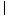
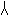
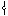
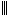
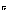
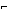
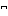

#  `U+1011C0..U+1011CF Jastugay Punctuation`  #

|  Code  |    Text    |                 As Image                 | Entry |
| -----: | :--------: | :--------------------------------------: | :---- |
| 1011C0 | &#x1011C0; |  | JASTUGAY FULL STOP |
| 1011C1 | &#x1011C1; |  | JASTUGAY HALF STOP |
| 1011C2 | &#x1011C2; |  | JASTUGAY EXCLAMATION MARK |
| 1011C3 | &#x1011C3; |  | JASTUGAY QUESTION MARK |
| 1011C4 | &#x1011C4; |  | JASTUGAY COLON |
| 1011C5 | &#x1011C5; |  | JASTUGAY SEMICOLON |
| 1011C6 | &#x1011C6; |  | JASTUGAY ELLIPSIS |
| 1011C7 | &#x1011C7; |  | JASTUGAY WORD SEPARATOR |
| 1011C8 | &#x1011C8; |  | JASTUGAY LEFT SINGLE QUOTATION MARK |
| 1011C9 | &#x1011C9; |  | JASTUGAY RIGHT SINGLE QUOTATION MARK |
| 1011CA | &#x1011CA; |  | JASTUGAY LEFT DOUBLE QUOTATION MARK |
| 1011CB | &#x1011CB; |  | JASTUGAY RIGHT DOUBLE QUOTATION MARK |
| 1011CC | &#x1011CC; |  | JASTUGAY LEFT PARENTHESIS |
| 1011CD | &#x1011CD; |  | JASTUGAY RIGHT PARENTHESIS |
| 1011CE | &#x1011CE; |  | JASTUGAY LEFT BRACKET |
| 1011CF | &#x1011CF; |  | JASTUGAY RIGHT BRACKET |
