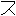
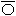
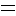
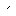
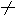
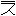
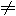
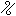
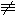

#  `U+1011E0..U+1011FF Runic Sevensi`  #

|  Code  |    Text    |                 As Image                 | Entry |
| -----: | :--------: | :--------------------------------------: | :---- |
| 1011E0 | &#x1011E0; |  | RUNIC SEVENSI LETTER ZI |
| 1011E1 | &#x1011E1; |  | RUNIC SEVENSI LETTER REI |
| 1011E2 | &#x1011E2; |  | RUNIC SEVENSI LETTER GO |
| 1011E3 | &#x1011E3; |  | RUNIC SEVENSI LETTER QEI |
| 1011E4 | &#x1011E4; |  | RUNIC SEVENSI LETTER HEI |
| 1011E5 | &#x1011E5; |  | RUNIC SEVENSI LETTER DO |
| 1011E6 | &#x1011E6; |  | RUNIC SEVENSI LETTER YI |
| 1011E7 | &#x1011E7; |  | RUNIC SEVENSI LETTER VAOI |
| 1011E8 | &#x1011E8; |  | RUNIC SEVENSI LETTER MA |
| 1011E9 | &#x1011E9; |  | RUNIC SEVENSI LETTER BA |
| 1011EA | &#x1011EA; |  | RUNIC SEVENSI LETTER WAE |
| 1011EB | &#x1011EB; |  | RUNIC SEVENSI LETTER NAI |
| 1011EC | &#x1011EC; |  | RUNIC SEVENSI LETTER JI |
| 1011ED | &#x1011ED; |  | RUNIC SEVENSI LETTER AEX |
| 1011EE | &#x1011EE; |  | RUNIC SEVENSI LETTER LAE |
| 1011EF | &#x1011EF; |                                          | &lt;reserved&gt; |
| 1011F0 | &#x1011F0; |  | RUNIC SEVENSI LETTER SI |
| 1011F1 | &#x1011F1; |  | RUNIC SEVENSI LETTER XEI |
| 1011F2 | &#x1011F2; |  | RUNIC SEVENSI LETTER KO |
| 1011F3 | &#x1011F3; |                                          | &lt;reserved&gt; |
| 1011F4 | &#x1011F4; |                                          | &lt;reserved&gt; |
| 1011F5 | &#x1011F5; |  | RUNIC SEVENSI LETTER TO |
| 1011F6 | &#x1011F6; |                                          | &lt;reserved&gt; |
| 1011F7 | &#x1011F7; |  | RUNIC SEVENSI LETTER FAOI |
| 1011F8 | &#x1011F8; |                                          | &lt;reserved&gt; |
| 1011F9 | &#x1011F9; |  | RUNIC SEVENSI LETTER PA |
| 1011FA | &#x1011FA; |                                          | &lt;reserved&gt; |
| 1011FB | &#x1011FB; |                                          | &lt;reserved&gt; |
| 1011FC | &#x1011FC; |  | RUNIC SEVENSI LETTER CI |
| 1011FD | &#x1011FD; |                                          | &lt;reserved&gt; |
| 1011FE | &#x1011FE; |  | RUNIC SEVENSI LETTER TLAE |
| 1011FF | &#x1011FF; |                                          | &lt;reserved&gt; |
