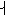
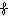

#  `U+101200..U+10121F Sevensi`  #

|  Code  |    Text    |                 As Image                 | Entry |
| -----: | :--------: | :--------------------------------------: | :---- |
| 101200 | &#x101200; |  | SEVENSI LETTER NULL |
| 101201 | &#x101201; |  | SEVENSI LETTER H |
| 101202 | &#x101202; |  | SEVENSI LETTER L |
| 101203 | &#x101203; |  | SEVENSI LETTER TL |
| 101204 | &#x101204; |  | SEVENSI LETTER G |
| 101205 | &#x101205; |  | SEVENSI LETTER R |
| 101206 | &#x101206; |  | SEVENSI LETTER D |
| 101207 | &#x101207; |  | SEVENSI LETTER Z |
| 101208 | &#x101208; |  | SEVENSI LETTER B |
| 101209 | &#x101209; |  | SEVENSI LETTER V |
| 10120A | &#x10120A; |  | SEVENSI LETTER K |
| 10120B | &#x10120B; |  | SEVENSI LETTER X |
| 10120C | &#x10120C; |  | SEVENSI LETTER T |
| 10120D | &#x10120D; |  | SEVENSI LETTER S |
| 10120E | &#x10120E; |  | SEVENSI LETTER P |
| 10120F | &#x10120F; |  | SEVENSI LETTER F |
| 101210 | &#x101210; |  | SEVENSI LETTER Q |
| 101211 | &#x101211; |  | SEVENSI LETTER Y |
| 101212 | &#x101212; |  | SEVENSI LETTER N |
| 101213 | &#x101213; |  | SEVENSI LETTER J |
| 101214 | &#x101214; |  | SEVENSI LETTER M |
| 101215 | &#x101215; |  | SEVENSI LETTER W |
| 101216 | &#x101216; |  | SEVENSI LETTER C |
| 101217 | &#x101217; |                                          | &lt;reserved&gt; |
| 101218 | &#x101218; |                                          | &lt;reserved&gt; |
| 101219 | &#x101219; |                                          | &lt;reserved&gt; |
| 10121A | &#x10121A; |                                          | &lt;reserved&gt; |
| 10121B | &#x10121B; |                                          | &lt;reserved&gt; |
| 10121C | &#x10121C; |                                          | &lt;reserved&gt; |
| 10121D | &#x10121D; |                                          | &lt;reserved&gt; |
| 10121E | &#x10121E; |                                          | &lt;reserved&gt; |
| 10121F | &#x10121F; |                                          | &lt;reserved&gt; |
