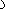
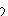
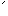
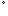

#  `U+101220..U+10122F Sevensi Marks and Punctuation`  #

|  Code  |    Text    |                 As Image                 | Entry |
| -----: | :--------: | :--------------------------------------: | :---- |
| 101220 | &#x101220; |  | SEVENSI POSITIVE VOWEL HARMONY MARK |
| 101221 | &#x101221; |  | SEVENSI NEGATIVE VOWEL HARMONY MARK |
| 101222 | &#x101222; |  | SEVENSI DEVOICING MARK |
| 101223 | &#x101223; |  | SEVENSI RING MARK |
| 101224 | &#x101224; |                                          | &lt;reserved&gt; |
| 101225 | &#x101225; |                                          | &lt;reserved&gt; |
| 101226 | &#x101226; |                                          | &lt;reserved&gt; |
| 101227 | &#x101227; |                                          | &lt;reserved&gt; |
| 101228 | &#x101228; |                                          | &lt;reserved&gt; |
| 101229 | &#x101229; |                                          | &lt;reserved&gt; |
| 10122A | &#x10122A; |                                          | &lt;reserved&gt; |
| 10122B | &#x10122B; |                                          | &lt;reserved&gt; |
| 10122C | &#x10122C; |                                          | &lt;reserved&gt; |
| 10122D | &#x10122D; |                                          | &lt;reserved&gt; |
| 10122E | &#x10122E; |                                          | &lt;reserved&gt; |
| 10122F | &#x10122F; |                                          | &lt;reserved&gt; |
