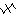

#  `U+101230..U+10123F Sevensi Presentation Forms`  #

|  Code  |    Text    |                 As Image                 | Entry |
| -----: | :--------: | :--------------------------------------: | :---- |
| 101230 | &#x101230; |  | SEVENSI LIGATURE WY |
| 101231 | &#x101231; |                                          | &lt;reserved&gt; |
| 101232 | &#x101232; |                                          | &lt;reserved&gt; |
| 101233 | &#x101233; |                                          | &lt;reserved&gt; |
| 101234 | &#x101234; |                                          | &lt;reserved&gt; |
| 101235 | &#x101235; |                                          | &lt;reserved&gt; |
| 101236 | &#x101236; |                                          | &lt;reserved&gt; |
| 101237 | &#x101237; |                                          | &lt;reserved&gt; |
| 101238 | &#x101238; |                                          | &lt;reserved&gt; |
| 101239 | &#x101239; |                                          | &lt;reserved&gt; |
| 10123A | &#x10123A; |                                          | &lt;reserved&gt; |
| 10123B | &#x10123B; |                                          | &lt;reserved&gt; |
| 10123C | &#x10123C; |                                          | &lt;reserved&gt; |
| 10123D | &#x10123D; |                                          | &lt;reserved&gt; |
| 10123E | &#x10123E; |                                          | &lt;reserved&gt; |
| 10123F | &#x10123F; |                                          | &lt;reserved&gt; |
